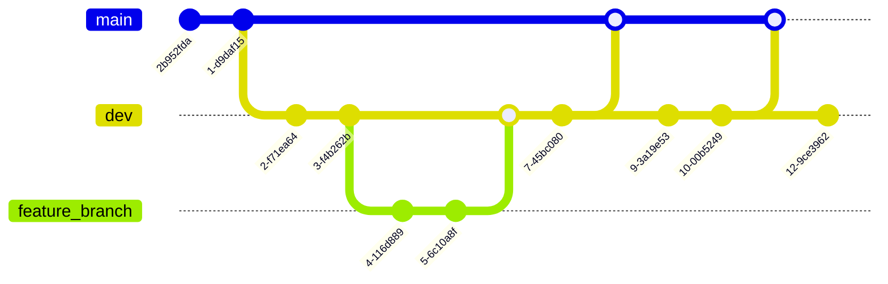
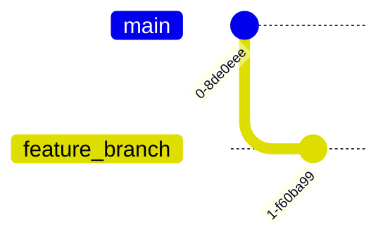
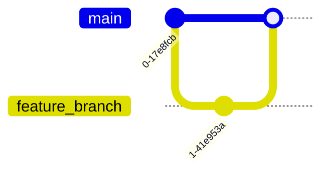
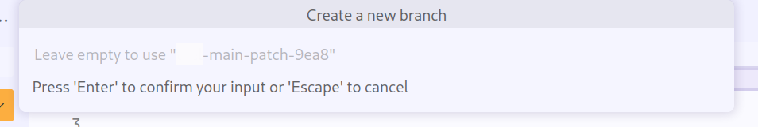
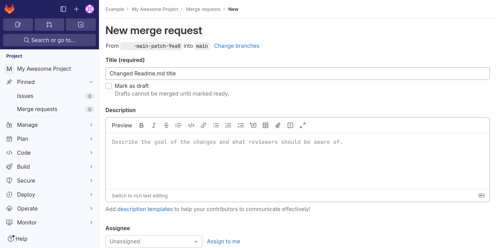

<!--

author:   Central Research Data Management of Kiel University
email:    fdm@rz.uni-kiel.de
version:  1.1.0
language: en
narrator: UK English Female
licence:  cc by

icon:     assets/images/cau-norm-en-lilagrey-rgb.png

logo:     https://git-scm.com/images/branching-illustration@2x.png

comment:  Online course for getting started with the version control system Git
          and the open source software development platform GitLab.

script:   https://cdn.jsdelivr.net/npm/mermaid@10.5.0/dist/mermaid.min.js

@onload
mermaid.initialize({ startOnLoad: false });
@end

@mermaid: @mermaid_(@uid,```@0```)

@mermaid_
<script run-once="true" modify="false" style="display:block; background: white">
async function draw () {
    const graphDefinition = `@1`;
    const { svg } = await mermaid.render('graphDiv_@0', graphDefinition);
    send.lia("HTML: "+svg);
    send.lia("LIA: stop")
};

draw()
"LIA: wait"
</script>
@end

@mermaid_eval: @mermaid_eval_(@uid)

@mermaid_eval_
<script>
async function draw () {
    const graphDefinition = `@input`;
    const { svg } = await mermaid.render('graphDiv_@0', graphDefinition);
    console.html(svg);
    send.lia("LIA: stop")
};

draw()
"LIA: wait"
</script>
@end

script:   https://cdn-0.plantuml.com/synchro2.min.js

@plantUML : @plantUML.exec(svg,```@0```)

@plantUML.svg: @plantUML.exec(svg,```@0```)

@plantUML.png: @plantUML.exec(png,```@0```)

@plantUML.exec
<script run-once modify="false">
function draw(type, code, counter = 10) {
  try {
    let s = unescape(encodeURIComponent(code));
    var arr = [];
    for (let i = 0; i < s.length; i++) {
      arr.push(s.charCodeAt(i));
    }
    let compressor = new Zopfli.RawDeflate(arr);
    let compressed = compressor.compress();
    let dest = "https://www.plantuml.com/plantuml/" + type + "/" + encode64_(compressed);
    send.html("")
    send.stop()
  } catch(e) {
    if (counter > 0) {
      setTimeout(draw(type, code, counter - 1), 100)
    } else {
      send.stop()
    }
  }
}

draw("@0", `@1`)
</script>

<span>

</span>
@end

@plantUML.eval
<script>
function draw(type, code, counter = 10) {
  try {
    let s = unescape(encodeURIComponent(code));
    var arr = [];
    for (let i = 0; i < s.length; i++) {
      arr.push(s.charCodeAt(i));
    }
    let compressor = new Zopfli.RawDeflate(arr);
    let compressed = compressor.compress();
    let dest = "https://www.plantuml.com/plantuml/" + type + "/" + encode64_(compressed);
    console.html("")
    console.log(dest)
    send.lia("LIA: stop")
  } catch(e) {
    if (counter > 0) {
      setTimeout(draw(type, code, counter - 1), 50)
    } else {
      send.lia("LIA: stop")
    }
  }
}

draw("@0", `@input`)
""
</script>
@end

-->

# Getting started with Git and GitLab

<!-- markdownlint-capture -->

<!-- markdownlint-disable MD033 -->

**Thorge Petersen, Britta Petersen, Thilo Paul-Stüve.**<br>
Central Research Data Management of Kiel University

<!-- markdownlint-restore -->

> To see this document as an interactive LiaScript rendered version, click on the
> following link/badge:
>
> [](https://liascript.github.io/course/?https://cau-git.rz.uni-kiel.de/fdm/schulungen/git-einfuehrung/-/raw/main/course.md)
>
> This course assumes a basic knowledge of command line interfaces.
>
> If you need help, feel free to ask us any questions:
>
> - [fdm@rz.uni-kiel.de](mailto:fdm@rz.uni-kiel.de)

## Introduction

**Agenda:**

During the next two hours we will look at the following:

- [Workshop rules, goals & limitations today](#workshop-rules)
- [Warm up](#warm-up)
- [Git](#git)

  - [Theoretical input](#git)
  - [Hands-On](#git-hands-on)

- [GitLab](#gitlab)

  - [Theoretical input](#gitlab)
  - [Hands-On](#gitlab-hands-on)

- [Open questions](#questions-or-comments)
- [Feedback](#feedback)

### Workshop rules

 <!-- width="250px" align="right" -->

- Draw attention to yourselves when you want to say something.
- Please ask if you do not understand something or if we are going too fast.
- Please hear each other out and let each other finish.
- Please help each other.
- Please do not do anything on the side.
- Please contribute actively.
- Please allow mistakes -> positive culture of mistakes.

### Goals today

 <!-- width="200px" align="right" -->

At the end of this workshop you should

- have an idea of the **general concept of Git** and can recall some important related terms,
- be able to distinguish between **local and remote repositories**,
- be able to use the command line or the [GitLab Web IDE](https://docs.gitlab.com/ee/user/project/web_ide/) to **create a project/repository**,
- be able to **make changes and commit them** via command line or GitLab Web IDE,
- be able to **checkout specific versions and branches** via command line,
- be able to **add members to a GitLab project** (within [GitLab RZ CAU](https://cau-git.rz.uni-kiel.de)),
- hopefully also **had some fun**!

### Limitations today

 <!-- width="250px" align="right" -->

During our session, we'll only scratch the surface of Git and GitLab's capabilities.

Unfortunately, due to time constraints, we won't be able to fully explore or only briefly touch upon the following topics:

- Using GUI clients for Git.
- Exploring advanced Git functionalities.
- Addressing subject-specific issues related to Git and GitLab.

### Warm up

> **Let's play a game...**
>
> I will read statements to you.
>
> I will read out statements and each time you agree, just stand up and raise your hand.
>
> That's it!

{{1}}
********************************************************************************

I like to drink coffee in the morning.

********************************************************************************

{{2}}
********************************************************************************

I am currently working on a PhD thesis.

********************************************************************************

{{3}}
********************************************************************************

If I have to decide whether to go to a movie or a concert, I'll probably choose the concert.

********************************************************************************

{{4}}
********************************************************************************

I work in the field of engineering.

********************************************************************************

{{5}}
********************************************************************************

I am a PI/supervisor.

********************************************************************************

{{6}}
********************************************************************************

I work in the field of materials science.

********************************************************************************

{{7}}
********************************************************************************

I have never worked with Git befor.

********************************************************************************

{{8}}
********************************************************************************

I live in Kiel.

********************************************************************************

{{9}}
********************************************************************************

I have a pet.

********************************************************************************

{{10}}
********************************************************************************

I am teaching students.

********************************************************************************

{{11}}
********************************************************************************

I am proficient in a programming language.

********************************************************************************

{{12}}
********************************************************************************

I work in the bio-medical field.

********************************************************************************

{{13}}
********************************************************************************

I already have a Git client installed on my computer.

********************************************************************************

## Git

**What is Version Management?**

- Keeping different variations of something in a comprehensible way.

  - Mostly files, in context of computers
  - Example:

    ```console
    File_v1.txt
    File_v2.txt
    ```

- Complex, if working with several people on the same thing at different locations

  - How to deal with editing conflicts?
  - How to deal with related files distributed in complex file hierarchies?
  - Manifold of creative approaches to file naming and version numbers
  - E-mail server as storage system

### Version Control Systems

- *Version Control Systems (VCS)* try to solve the *technical* problems of collaborative editing

  - Early 1980s: Shared file systems with locks on files, e.g., [Revision Control System](https://www.gnu.org/software/rcs/)
  - Early 2000s: Client-Server-Solutions introducing a central working directory, *branches* and *tags*, e.g., [Subversion](https://subversion.apache.org/)
  - Mid 2000s: **Distributed Version Control Systems (DVCS)**, e.g., [Mercurial](https://www.mercurial-scm.org/), [Git](https://git-scm.com/)

- DVCSs are currently state of the art for version management

  - Peer-to-peer architecture
  - Means for conflict resolution

- Architectures: Peer-to-Peer vs Client-Server

```text @plantUML
@startuml

[Central Repository] .. [Client 1]
[Central Repository] .. [Client 2]
[Central Repository] .. [Client 3]

note top of [Central Repository]: Client-Server

[Repository 1] .down. [Repository 2]
[Repository 1] .down. [Repository 3]
[Repository 1] .down. [Repository 4]
[Repository 2] .down. [Repository 3]
[Repository 2] .down. [Repository 4]
[Repository 3] .right. [Repository 4]

note top of [Repository 1]: Peer-to-Peer
@enduml
```

### What is Git

 <!-- align=right -->

- Warning: **Git is a complex beast**
- Open Source DVCS developed by Linus Torvalds[^1] for Linux-Kernel development
- Designed to facilitate:

  - Collaboration among diverse contributors worldwide.
  - Managing huge amounts of text files, notably source code files.
  - Managing changes spanning multiple files within complex directory structures.
  - Exploring (and discarding) different approaches of development.
  - Managing different variants and releases.

[^1]: Picture of Linus Torvalds: Lf Asia, CC-BY 3.0 unported

### Why Git


### Git is Flexible

- **Basic idea**

  > Your repository is on your computer and you can bring it into sync with other repositories (maybe somewhere else).

  ```text @plantUML
  @startuml
  [Repository 1] .down. [Repository 2]
  [Repository 1] .down. [Repository 3]
  [Repository 1] .down. [Repository 4]
  [Repository 2] .down. [Repository 3]
  [Repository 2] .down. [Repository 4]
  [Repository 3] .right. [Repository 4]
  @enduml
  ```

{{1}}
********************************************************************************

**Working Offline:**

- Work autonomously and synchronise later.
- Collaborate within a small team and synchronise locally, such as through a LAN or memory stick.
- Sync with repositories by alternative means, like sending data via snail mail.

********************************************************************************

{{2}}
********************************************************************************

**Working Online:**

- Sync with remote repositories over the internet.
- Maintain continuous synchronization with a central repository online.

********************************************************************************

{{3}}
********************************************************************************

**Combined Approach:**

- Integrate elements from both offline and online workflows.

> **Common Practice:**
>
> Multiple local repositories are synchronised with a central repository, serving as the authoritative source of truth.

********************************************************************************

### Branches and Tags

Branches and tags are both mechanisms for labeling and identifying specific points in the version history of a repository.

{{1}}
********************************************************************************

**Branches:**



- When you work with a git repository you always work in a *branch*.

  - Branches are identified by a name. The default branch is commonly named `main`.
  - Each commit on a branch is identified by a unique *commit hash*, e.g., `2b952fda`.
  - The branch name itself always points to the latest commit.

- To pursue uninterrupted development or test features without affecting collaborators, creating a new branch is advisable. Common are branches for:

  - A stable version (often the `main` branch).
  - Ongoing development (often called `dev`).
  - Introducing new features (typically named after the feature that is realised, e.g., `feature_branch`).

- Branches are identified by a name and reference a *commit*, with the branch name always pointing to the latest commit.

- To integrate changes from one branch into another, you can perform a *merge*, which involves incorporating all commits from the branch to be merged into the current branch (and resolving any conflicts that arise).

  > **Git commands:** [git branch](https://git-scm.com/docs/git-branch) and [git merge](https://git-scm.com/docs/git-merge)

********************************************************************************

{{2}}
********************************************************************************

**Tags:**


- When you want to mark a specific commit for later reference, you can tag it.

  - For instance, you might tag a commit to signify a specific version of your work, such as `1.0.0`, `alpha` or `milestone1`.

- *Tags* have a name and always refer to the same *commit*, unless you change it yourself.

> **Git command:** [git tag](https://git-scm.com/docs/git-tag)

********************************************************************************

### Git Usage

**Git lives on the command line:**

```console
$ git --help
usage: git [--version] [--help] [-C <path>] [-c <name>=<value>]
         [--exec-path[=<path>]] [--html-path] [--man-path] [--info-path]
         [-p | --paginate | -P | --no-pager] [--no-replace-objects] [--bare]
         [--git-dir=<path>] [--work-tree=<path>] [--namespace=<name>]
         [--super-prefix=<path>] [--config-env=<name>=<envvar>]
         <command> [<args>]

These are common Git commands used in various situations:

start a working area (see also: git help tutorial)
  clone             Clone a repository into a new directory
…
'git help -a' and 'git help -g' list available subcommands and some
concept guides. See 'git help <command>' or 'git help <concept>'
to read about a specific subcommand or concept.
See 'git help git' for an overview of the system.
```

- [Download Git for your operating system](https://git-scm.com/downloads)
- [Git Cheat Sheet](https://liascript.github.io/course/?https://cau-git.rz.uni-kiel.de/fdm/schulungen/git-einfuehrung/-/raw/main/course_materials/git_cheat_sheet.md) – A quick reference guide for essential Git commands.

{{1}}
********************************************************************************

**There are 3rd-party clients for using Git:**

- More integrated in your **computer's GUI**, e.g.,

  - [GitKraken](https://www.gitkraken.com) (GNU/Linux, MacOS, Windows)
  - [SourceTree](https://www.sourcetreeapp.com) (MacOS, Windows)
  - [TortoiseGit](https://tortoisegit.org) (Windows)

********************************************************************************

{{2}}
********************************************************************************

- **Web GUIs**, e.g.,

   <!-- align=right width=450px -->

  - [Gitea](https://gitea.io) (on premise)
  - [GitHub](https://github.com) (SaaS, on premise)
  - [GitLab](https://gitlab.com) (SaaS, on premise)
  - [Gogs](https://gogs.io) (on premise)

********************************************************************************

### Command Overview

```text @plantUML
@startuml
"Working directory" -> "Staging Area": git add <file> …
"Staging Area" -> "Local Repository": git commit -m "message"
"Working directory" <- "Local Repository": git checkout <branch>
"Local Repository" -> "Remote Repository": git push
"Local Repository" <- "Remote Repository": git fetch
"Working directory" <- "Local Repository": git merge <commit>
"Working directory" <- "Remote Repository": git pull
@enduml
```

For further information refer to the [Git Documentation](https://git-scm.com/docs/) or see the [Git Cheat Sheet](https://liascript.github.io/course/?https://cau-git.rz.uni-kiel.de/fdm/schulungen/git-einfuehrung/-/raw/main/course_materials/git_cheat_sheet.md).

### Git Hands-on

{{1}}
********************************************************************************

**Install Git**:

If you haven't already, download and install Git from the official website: [git-scm.com](https://git-scm.com/).

********************************************************************************

{{2}}
********************************************************************************

**Configure Git**:

Open a terminal or command prompt and set your name and email address. Replace `Your Name` and `your.email@example.com` with your actual name and email.

```bash
git config --global user.name "Your Name"
git config --global user.email "your.email@example.com"
```

********************************************************************************

#### Initializing a Git Repository

Follow these steps to initialise a new Git repository:

{{1}}
********************************************************************************

**Create a New Directory**:

Create a new directory where you want to initialise your Git repository.

```bash
mkdir my_awesome_project
cd my_awesome_project
```

********************************************************************************

{{2}}
********************************************************************************

**Initialise Git**:

Run the following command to initialise Git in the directory.

```bash
git init
```

This command sets up a fresh Git project. By default, it initialises the main branch:


> A `.git` directory is now present in your working directory. It holds crucial Git-related data.

********************************************************************************

{{3}}
********************************************************************************

**Example**:
!?[Initializing a Git Repository](assets/videos/git_init.webm)

********************************************************************************

#### Basic Git Commands

Now let's try to add some file and commit the changes.

{{1}}
********************************************************************************

**Adding Files**:

Create some files in your project directory and then add them to the staging area.

```bash
touch file1.txt file2.txt
git add file1.txt file2.txt
```

********************************************************************************

{{2}}
********************************************************************************

**Committing Changes**:

Commit the staged files to the repository.

```bash
git commit -m "Initial commit"
```


********************************************************************************

{{3}}
********************************************************************************

**Show Information**:

View expanded details about your latest commit.

```bash
git show
```

********************************************************************************

{{4}}
********************************************************************************

**Checking Repository Status**:

Check the status of your repository.

```bash
git status
```

********************************************************************************

{{5}}
********************************************************************************

**Example**:
!?[Adding Files and Committing Changes](assets/videos/git_commit.webm)

********************************************************************************

#### Branching and Merging

Let's proceed by creating a new branch to implement a new feature.

Once our changes are completed on the feature branch, we'll merge it back into our main branch.

{{1}}
********************************************************************************

**Creating a Branch**:

Create a new branch for feature development.

```bash
git branch feature_branch
```


********************************************************************************

{{2}}
********************************************************************************

**Switching Branches**:

Switch to the newly created branch.

```bash
git checkout feature_branch
```

********************************************************************************

{{3}}
********************************************************************************

**Making Changes**:

Make changes to your files in the feature branch.

********************************************************************************

{{4}}
********************************************************************************

**Adding and Committing Changes**:

Add and commit your changes.

```bash
git add . # stage all changes in the current directory and its subdirectories
git commit -m "Implemented feature X"
```



********************************************************************************

{{5}}
********************************************************************************

**Merging Branches**:

Git merging operates by initially switching to the branch you desire to merge into, followed by executing the merge command to integrate changes from another branch.

Let's switch back to the main branch and merge the feature branch into it.

```bash
git checkout main
git merge feature_branch
```



********************************************************************************

{{6}}
********************************************************************************

**Example**:
!?[Branching and Merging](assets/videos/git_branch.webm)

********************************************************************************

#### Merge Conflicts

Merge conflicts occur when conflicting changes exist between the source and target branches of a merge request, requiring resolution to determine which changes to accept.

- During a merge request, GitLab compares the two versions of files line by line.
- GitLab typically merges changes automatically, but if conflicting changes exist on the same lines, the merge is blocked, necessitating manual intervention.

{{1}}
********************************************************************************

**Typical Scenario:**


- Initially, both **Person A** and **Person B** start with `Version 1` of a file from the remote repository.
- **Person A** makes changes, resulting in `Version 2A`, while **Person B** makes different changes, leading to `Version 2B`.
- **Person A** pushes their changes to the repository, updating it to `Version 2A`.
- When **Person B** tries to push his changes, the remote repository has `Version 2A`, causing a merge conflict.

********************************************************************************

{{2}}
********************************************************************************

**Resolving Merge Conflicts:**


- To resolve this conflict, **Person B** initiates a pull operation. This action updates his local repository with a combination of `Version 2A` and `Version 2B`, highlighting any disparities between his changes and those made by **Person A**.
- **Person B** then addresses these differences, manually resolving conflicts where necessary.
- Finally, **Person B** pushes the resolved changes to the repository, creating `Version 3`, which incorporates modifications from both **Person A** and **Person B**.

********************************************************************************

##### Handling Merge Conflicts

When resolving merge conflicts via the command-line, the process typically involves the following steps:

{{1}}
********************************************************************************

**Identify Conflicting Files:**

Git will indicate which files have conflicts. You can use `git status` to see which files are in conflict.

********************************************************************************

{{2}}
********************************************************************************

**Open Conflicting Files:**

Open the conflicted files in your preferred text editor. Inside the files, Git will mark the conflicting sections, usually with special markers like `<<<<<<<`, `=======`, and `>>>>>>>`.

********************************************************************************

{{3}}
********************************************************************************

**Resolve Conflicts:**

Manually edit the conflicted sections in the files to resolve the differences. Remove the conflict markers and decide which changes to keep or combine.

********************************************************************************

{{4}}
********************************************************************************

**Stage the Resolved Files:**

After resolving conflicts, stage the modified files using `git add <resolved-file>`.

********************************************************************************

{{5}}
********************************************************************************

**Complete the Merge:**

Once all conflicts are resolved and files are staged, complete the merge using `git commit`. Git will create a merge commit to finalise the merge.

********************************************************************************

#### Remote Repositories

Sharing our work requires a reliable server to host our Git repositories (like [GitLab RZ CAU](https://cau-git.rz.uni-kiel.de) or [GitHub](https://github.com)).

{{1}}
********************************************************************************

**Adding a Remote**:

Link your local repository to a remote repository.

```bash
git remote add origin <remote_repository_url>
```

> - `git remote add`: This command adds a new remote repository to your local repository.
> - `origin`: This is the name you're assigning to the remote repository. In Git conventions, `origin` is commonly used as the default name for the remote repository from which you initially cloned your local repository.
> - `<remote_repository_url>`: This is the URL of the remote repository you want to add. It specifies the location where your local repository will push changes and fetch updates.

********************************************************************************

{{2}}
********************************************************************************

**Pushing Changes**:

Push your committed changes to the remote repository.

```bash
git push -u origin main
```

> - `git push`: This command is used to push your local commits to a remote repository.
> - `-u`: This option sets the upstream branch for the current local branch. It tells Git to remember the association between your local branch and the corresponding branch on the remote repository. After setting the upstream branch, you can simply use `git push` in future pushes without specifying the remote and branch name.
> - `origin`: This specifies the name of the remote repository. In Git, `origin` is often the default name given to the remote repository from which you cloned your local repository.
> - `main`: This specifies the branch to which you want to push your local commits. In this case, you're pushing your local commits to the `main` branch on the remote repository.

********************************************************************************

{{3}}
********************************************************************************

**Pulling Changes**:

Pull changes from the remote repository to your local repository.

```bash
git pull origin main
```

> The command `git pull origin main` combines two operations in Git:
>
> 1. **`git fetch`:** It retrieves new changes from the remote repository specified by `origin`, which is typically the default name for the remote repository from which you originally cloned or fetched. This operation updates your local copy of the remote branches, but it does not automatically merge them into your current branch.
>
> 2. **`git merge`:** After fetching the changes, Git automatically merges the changes from the remote `main` branch into your current local branch. This operation brings your local branch up to date with the latest changes from the remote `main` branch.

********************************************************************************

## GitLab

<!-- width="250px" align="right" -->

**[GitLab](https://about.gitlab.com/) is a Git-based fully integrated platform for software development that provides complete DevOps and project management solutions.**

- GitLab is open source.
- GitLab is provided by GitLab Inc., that runs [GitLab.com](https://about.gitlab.com/) on a freemium and offers a subscription service.

<!-- style="display: block; margin: auto; padding-top:50px;" -->

{{1}}
********************************************************************************

**Projects:**

In GitLab, projects serve as the cornerstone for hosting your codebase. They offer a comprehensive suite of features, including:

- **Git Repository:** Where your code resides.
- **Issue Tracker:** A robust system for tracking and managing issues.
- **Merge Requests:** Allows for code review and discussion before merging changes.
- **Wiki:** A dedicated platform for documentation, seamlessly integrated into GitLab.
- Additional tools and functionalities to enhance your project management.

********************************************************************************

{{2}}
********************************************************************************

**Groups:**

Groups in GitLab act as containers for multiple projects. Key features include:

- **Organizational Structure:** Grouping projects under a single entity for better organization.
- **Permission Management:** Control over member permissions and access levels for each project within the group.

********************************************************************************

{{3}}
********************************************************************************

**Subgroups:**

Subgroups offer a hierarchical structure within groups, providing flexibility and scalability:

- **Nested Organization:** Create up to 20 levels of nested groups, allowing for granular organization within larger groups.

********************************************************************************

### GitLab RZ CAU

> **The Computing Center of Kiel University centrally operates the Git service [GitLab RZ CAU](https://cau-git.rz.uni-kiel.de/) for CAU facilities.**
>
> The service is based on a dedicated GitLab installation.
>
> You can access the service at [https://cau-git.rz.uni-kiel.de/](https://cau-git.rz.uni-kiel.de/).

{{1}}
********************************************************************************

**Service registration:**

The registration takes place with the user identifier (RZ-LDAP identification) for general services.

An explicit activation is not necessary for the registration.

********************************************************************************

{{2}}
********************************************************************************

**Project group assignment:**

The Computing Center of Kiel University sets up project groups on request.

- **Eligibility:** Heads of recognised facilities affiliated with the Computing Center are eligible to apply for project group setup.

- **Administrators:** Each project group can designate one or more administrators who are initially tasked with overseeing new project groups.

- **Administrative Capabilities:** Within their respective project groups, administrators have the autonomy to:

  - Create new projects.
  - Delete projects when necessary.
  - Assign rights to any user possessing a valid user identifier, ensuring controlled access and permissions.

- **Delegated Administration:** Project administrators are responsible for further managing rights within subordinate groups and projects, ensuring efficient delegation of administrative tasks.

********************************************************************************

### GitLab Hands-on

> **The following hands-on examples are all performed using [GitLab RZ CAU](https://cau-git.rz.uni-kiel.de).**
>
> - All examples can be run using [GitLab RZ CAU](https://cau-git.rz.uni-kiel.de) web interface and the Web Integrated Development Environment (IDE) editor.
> - Many of the examples will be similar in other GitLab installations.
>
> **You can find the login page of [GitLab RZ CAU](https://cau-git.rz.uni-kiel.de) at [https://cau-git.rz.uni-kiel.de/users/sign_in](https://cau-git.rz.uni-kiel.de/users/sign_in).**
>
> To log in you need your
>
> - RZ-LDAP username (e.g., *szrzs123*, *sughi456* etc.)
> - Password

{{1}}
********************************************************************************

**Hands-on:**

> Please try to log in to the [GitLab RZ CAU](https://cau-git.rz.uni-kiel.de/users/sign_in) now.
>
> - If you are unable to log in, please let us know.

<!-- style="max-height: 55vh; display: block; margin: auto;" -->

********************************************************************************

{{2}}
********************************************************************************

**Terms of Service:**

If you are registering for the first time, you must agree to the *Terms of Service*.

<!-- style="max-height: 55vh; display: block; margin: auto;" -->

********************************************************************************

{{3}}
********************************************************************************

**Did everything work out?**

If you were able to log in correctly, you will see your [dashboard](https://cau-git.rz.uni-kiel.de/).

<!-- style="max-height: 55vh; display: block; margin: auto;" -->

*Note: If you have previously registered or have already been invited to projects or groups, you will probably see your [project overview](https://cau-git.rz.uni-kiel.de/dashboard/projects) instead.*

********************************************************************************

#### Join the Småland

We have a playground subgroup called [Småland](https://cau-git.rz.uni-kiel.de/fdm/smaland) that we would like to invite you to join.

We would like to do this by creating another subgroup for you in [Småland](https://cau-git.rz.uni-kiel.de/fdm/smaland). There you can create projects and test the GitLab tools.

<!-- style="max-height: 55vh; display: block; margin: auto;" -->

{{1}}
********************************************************************************

**Invitation to the Småland:**

Please share your user ID with us now so that we can create a new subgroup for you in our [Småland](https://cau-git.rz.uni-kiel.de/fdm/smaland).

We will then invite you to your new subgroup and give you *owner* permissions.

********************************************************************************

{{2}}
********************************************************************************

**Find your groups:**

Have you already been invited? Let's find out..

To show an overview of all your [groups](https://cau-git.rz.uni-kiel.de/dashboard/groups), click on the *Groups* tab in the main menu and then on the *Your Groups* submenu item.

<!-- style="max-height: 55vh; display: block; margin: auto;" -->

********************************************************************************

{{3}}
********************************************************************************

**Your groups:**

You will now see some information about your groups.

If you expand the [FDM](https://cau-git.rz.uni-kiel.de/fdm) and the [Småland](https://cau-git.rz.uni-kiel.de/fdm/smaland) (sub)groups, you will also be able to see your new subgroup we just invited you to.

<!-- style="max-height: 55vh; display: block; margin: auto;" -->

*Note, you should have guest role in [Småland](https://cau-git.rz.uni-kiel.de/fdm/smaland) subgroup and owner role in your own subgroup.*

********************************************************************************

#### Create a new project

> **In GitLab, you can create projects to host your codebase**
>
> If you want to create projects, your account must be assigned to a *group* and have at least *developer* permissions.

Projects can be available

- *publicly* (not available by default in GitLab RZ CAU)
- *internally*
- *privately*

{{1}}
********************************************************************************

**Create new project:**

To [create a new project](https://cau-git.rz.uni-kiel.de/projects/new), click on the *Projects* tab in the main menu and then on the *Create new project* submenu item.

<!-- style="max-height: 55vh; display: block; margin: auto;" -->

********************************************************************************

{{2}}
********************************************************************************

**Create blank project:**

Create a *blank project* to house your files, plan your work, and collaborate on code, among other things.

<!-- style="max-height: 55vh; display: block; margin: auto;" -->

********************************************************************************

{{3}}
********************************************************************************

**Fill out the details:**

You can now fill in some details about your project.

- In the *Project name* text box, you can enter your project name.
- In the *Project description* text box, you can enter your project description.

Finally click the *Create project* button at the bottom of the page.

<!-- style="max-height: 55vh; display: block; margin: auto;" -->

*Note, in the project URL textbox you can select from a drop-down menu your groups of which you are a member and have appropriate rights to create projects.*

********************************************************************************

{{4}}
********************************************************************************

**That's it:**

You have successfully created a blank project.


********************************************************************************

#### Create files and directories

> **Once you have created a project you can start to create or to add files and directories to your project.**
>
> In this example you will use the Web Integrated Development Environment (IDE) editor to contribute changes to your project.

You can add a file to your project by

- [creating a new file](#create-a-new-file)
- [uploading an existing file](#upload-an-existing-file)

##### Create a new file

Let's start by creating a new file.

{{1}}
********************************************************************************

**Open the Web IDE:**

Use the `.` keyboard shortcut to open the Web IDE or click on the *Web IDE* button in your project overview:

<!-- style="max-height: 55vh; display: block; margin: auto;" -->

*Note, you can also open the Web IDE when viewing a file, from the repository file list, and from merge requests.*

********************************************************************************

{{2}}
********************************************************************************

**The Web IDE:**

The Web IDE editor streamlines the process to contribute changes to your projects, by providing an advanced editor with commit staging.

The left sidepanel contains 5 Views, from which the first three are most likely to be of interest

- The Explorer, which gives a file and folder view of your project
- The Search Tool, from which you can search for any text inside your project
- Source Control, from which commits can be done

<!-- style="max-height: 55vh; display: block; margin: auto;" -->

*Note that another file (README.md) is already included in your project. This was automatically created for you when you created the project in the previous example. This special Markdown file will be used in your project overview to describe the project.*

********************************************************************************

{{3}}
********************************************************************************

**Create your file:**

If not already the case, make sure the Explorer View is enabled by clicking on the topmost icon of the Left Sidebar.
Then click on the *new file* icon to create a new file.

<!-- style="max-height: 55vh; display: block; margin: auto;" -->

********************************************************************************

{{4}}
********************************************************************************

**Name your file:**

Once you clicked on *new file* icon a new blank file will be placed in the explorer view, asking you to fill in a name.
Don't forget the File Extension

<!-- style="max-height: 55vh; display: block; margin: auto;" -->

********************************************************************************

{{5}}
********************************************************************************

**Make changes and commit them:**

You can now add some contents to the file, if you like. We added some simple Markdown in the file editor as an example.

Any changes you make to the files and folders of your project will not become active immediately, you must first commit the changes.

Click on the third Icon that looks like a *Fork*, to open the *Source Control View*

<!-- style="max-height: 55vh; display: block; margin: auto;" -->

********************************************************************************

{{6}}
********************************************************************************

**Fill out the details:**

Every commit needs a commit message.

1. Please provide a brief description of the changes you made in the *Commit Message* text box.
2. We are working on only one branch in this example, the *main* branch. Therefore, we will keep the main branch selected.
3. Finish with pressing the *Commit* button.

<!-- style="max-height: 55vh; display: block; margin: auto;" -->

<!-- Hier muss sehr viel nacheditiert werden -->

********************************************************************************

{{7}}
********************************************************************************

**That's it:**


The system lets you know that the changes have been successfully committed.

You should now be able to see your newly added file in the *file overview* of your project.

To open the file overview, click on *Go to Project* or click on the *GitLab* Button in the Bottom Left Corner,
and confirm *Go to my Awesome Project* in the Floating Prompt.

<!-- style="max-height: 55vh; display: block; margin: auto;" -->

********************************************************************************

{{8}}
********************************************************************************

**Commit history:**

You should also be able to see your commit history in the *commit view* of your project.

To open the commit view, click on the submenu item *Commits* in the side menu under *Code*.

<!-- style="max-height: 55vh; display: block; margin: auto;" -->

********************************************************************************

##### Upload an existing file

Now let us upload an existing file. It is even easier.

{{1}}
********************************************************************************

**Open the Web IDE:**

Use the `.` keyboard shortcut to open the Web IDE or click on the *Web IDE* button in your project overview:

<!-- style="max-height: 55vh; display: block; margin: auto;" -->

*Note, you can also open the Web IDE when viewing a file, from the repository file list, and from merge requests.*

********************************************************************************

{{2}}
********************************************************************************

**Select the file to upload:**

Open the *Explorer View* and right-click on free space in the Directory Tree.
Choose *Upload...* and follow the Instructions of your Operating System to Upload a File of your Choice.

<!-- style="max-height: 55vh; display: block; margin: auto;" -->

********************************************************************************

{{3}}
********************************************************************************

**Your file:**

We uploaded a Markdown file called *test.md* here. It just contains some simple text.
Although the file is uploaded to our IDE, it still needs to be commited, as does any other Edit inside the *Working Directory*.
Again, click on the third Icon that looks like a *Fork*, to open the *Source Control View*, from which *Commits* are possible.

<!-- style="max-height: 55vh; display: block; margin: auto;" -->

********************************************************************************

{{4}}
********************************************************************************

**Commit your changes:**

Click on the *Create commit...* button to prepare the commit.

<!-- style="max-height: 55vh; display: block; margin: auto;" -->

Again, leave a commit message describing your action and finish with pressing the *Commit* button.

1. Please provide a brief description of the changes you made in the *Commit Message* text box.
2. We are working on only one branch in this example, the *main* branch. Therefore, we will again leave the *main* branch selected.
3. Finish with pressing the *Commit* button.

********************************************************************************

{{5}}
********************************************************************************

**That's it:**

The system lets you know that the changes have been successfully committed.

You should now be able to see your newly added file in the *file overview* of your project.

To open the file overview, click on *Go to Project* or click on the *GitLab* Button in the Bottom Left Corner,
and confirm *Go to my Awesome Project* in the Floating Prompt.

<!-- style="max-height: 55vh; display: block; margin: auto;" -->

********************************************************************************

##### Create a directory

You want to organise your files in folders? You can also create directories via the Web IDE.

{{1}}
********************************************************************************

**Open the Web IDE:**

Use the `.` keyboard shortcut to open the Web IDE or click on the *New dicretory* button in your project overview:

<!-- style="max-height: 55vh; display: block; margin: auto;" -->

*Note, you can also open the Web IDE when viewing a file, from the repository file list, and from merge requests.*

********************************************************************************

{{2}}
********************************************************************************

**Create your directory:**

To Create a Directory, the *Explorer* view has to be enabled first.
Please click on the *Create directory* icon to create a new directory.

<!-- style="max-height: 55vh; display: block; margin: auto;" -->

********************************************************************************

{{3}}
********************************************************************************

**Name your directory:**

Enter a name for your new directory and confirm your input by pressing the *Enter* key

<!-- style="max-height: 55vh; display: block; margin: auto;" -->

********************************************************************************

{{4}}
********************************************************************************

**Add a file to your new directory:**

Your new directory appears in your file list on the left side, but the system does not allow you to create a commit unless you add a file to your new directory, either by creating a new file or by uploading an existing file.

To do so, click on your new Directory, to mark it for selection. Then Click on the *New File* Icon on the top right of the *Explorer* View, similar to the steps in[creating a new file](#create-a-new-file).
Alternatively Right-Click on your new Folder and Click on *Upload*, afterwards follow the steps in [uploading an existing file](#upload-an-existing-file).

<!-- style="max-height: 55vh; display: block; margin: auto;" -->

********************************************************************************

{{5}}
********************************************************************************

**Create a commit and fill out the details:**

Enter the *Source Control* View, by clicking on the *Fork* Icon.
Leave a commit message describing your action and finish with pressing the *Commit* button.

1. Please provide a brief description of the changes you made in the *Commit Message* text box.
2. We are working on only one branch in this example, the *main* branch. Therefore, we will again leave the *main* branch selected.
3. Finish with pressing the *Commit* button.

<!-- style="max-height: 55vh; display: block; margin: auto;" -->

********************************************************************************

{{6}}
********************************************************************************

**That's it:**

The system lets you know that the changes have been successfully committed.

You should now be able to see your newly added directory in the *file overview* of your project.
To open the *file overview*, click on *Go to Project* or click on the *GitLab* Button in the Bottom Left Corner,
and confirm *Go to my Awesome Project* in the Floating Prompt.

<!-- style="max-height: 55vh; display: block; margin: auto;" -->

********************************************************************************

#### Handling Merge Conflicts

> As you might recall from the hands-on Git command line section, merging branches in Git can sometimes lead to conflicts. These conflicts arise when Git cannot automatically reconcile differences between the branches, typically occurring when the same section of a file has been modified differently in the branches being merged.
>
> In GitLab, when a merge conflict arises, you'll receive an immediate notification, signaling the need to address conflicting changes within the codebase.

{{1}}
********************************************************************************

If your merge conflict meets all of the following criteria, you can resolve the merge conflict in the GitLab user interface:

- The file is text, not binary.
- The file is in a UTF-8 compatible encoding.
- The file does not already contain conflict markers.
- The file, with conflict markers added, is less than 200 KB in size.
- The file exists under the same path in both branches.

********************************************************************************

##### Types of conflict resolution

> There are several different ways we might want to resolve a conflict:
>
> - Just pick one version, and use that.
> - Keep the lines from both versions.
> - Write your own resolution manually.

##### Example of a merge conflict

**Let us demonstrate this with an example:**

- We now want everyone to find a partner.
- We want to provoke a merge conflict by having two of you each make changes to the same file that cannot be automatically merged.
- You can choose who wants to do a little more work (*person A*) and who wants to do a little less (*person B*).

If everyone has found a partner and it is clear who is *person A* and who is *person B*, we can start.

{{1}}
********************************************************************************

**Overview:**

We'll go through the process step by step with you in a moment, but here's an overview:

1. person A invites person B to your repository created in the previous example
2. person A grants person B *maintainer* role
3. person A opens an existing file from your repository in the Web IDE editor.
4. person B opens the same file in a separate Web IDE editor
5. person A inserts changes in a line of your choice
6. person B makes other changes to the same line
7. person B creates a commit
8. person A creates a commit (-> merge conflict)
9. person A resolves the merge conflict

********************************************************************************

{{2}}
********************************************************************************

**Invite person B to your repository (person A):**

Please invite person A to your repository and grant maintainer roles:

1. Go to your repository.
2. Go to `Manage -> Members`.
3. Click on the `Invite members` button.
4. Search for person A and grant maintainer role.

********************************************************************************

{{3}}
********************************************************************************

**Open an existing file in the Web IDE (person A):**

Go to the repository that you have been invited to. Use the `.` keyboard shortcut to open the Web IDE or click on the *Web IDE* button in your project overview. Then select a file in the file and folder view, e.g., the *README.md* file.

<!-- style="max-height: 55vh; display: block; margin: auto;" -->

********************************************************************************

{{4}}
********************************************************************************

**Open the same file in the Web IDE (person B):**

Use the `.` keyboard shortcut to open the Web IDE or click on the *Web IDE* button in the project overview. Then select the same file that person A opened in the file and folder view.

You should now both see the same view of the file.

********************************************************************************

{{5}}
********************************************************************************

**Make changes (person A):**

1. Now make changes to the file. For example, change the title `My awesome project` to `My really awesome project`.

<!-- style="max-height: 55vh; display: block; margin: auto;" -->

********************************************************************************

{{6}}
********************************************************************************

**Make changes (person B):**

1. Now make changes to the the same file.

    - To provoke a merge conflict, make changes to the same line that person A made changes to.
    - For example, change the title `My awesome project` to `The most awesome project on GitLab`.

2. Click on the *Create commit...* button to prepare the commit.

<!-- style="max-height: 55vh; display: block; margin: auto;" -->

********************************************************************************

{{7}}
********************************************************************************

**Create a commit and fill out the details (person B):**

Leave a commit message describing your action and finish with pressing the *Commit* button.

1. Please provide a brief description of the changes you made in the *Commit Message* text box.
2. We are working on only one branch in this example, the *main* branch. Therefore, select the *Commit to main branch* option.
3. Finish with pressing the *Commit* button.

The commit should be accepted without a conflict.

<!-- style="max-height: 55vh; display: block; margin: auto;" -->

********************************************************************************

{{8}}
********************************************************************************

**Create a commit and fill out the details (person A):**

Click on the *Create commit...* button to prepare the commit. Leave a commit message describing your action and finish with pressing the *Commit* button.

1. Please provide a brief description of the changes you made in the *Commit Message* text box.
2. We are working on only one branch in this example, the *main* branch. Therefore, select the *Commit to main branch* option.
3. Finish with pressing the *Commit* button.

**(!)** The commit should provoke a conflict.

<!-- style="max-height: 55vh; display: block; margin: auto;" -->

********************************************************************************

{{9}}
********************************************************************************

**Choose new branch (person A):**

If you have created a change that Git does not automatically merge, GitLab will inform you that the file has changed.

You will no longer be able to store your results in the *main* branch (with which we started the work).

Instead, you can create a new branch.

<!-- style="max-height: 55vh; display: block; margin: auto;" -->

<!-- style="max-height: 55vh; display: block; margin: auto;" -->

********************************************************************************

{{10}}
********************************************************************************

**Create merge request (person A):**

<!-- style="max-height: 55vh; display: block; margin: auto;" -->

GitLab now asks you to create a *merge request* to merge the new state written by person B on branch main with the state stored by person A on the separate branch.

<!-- style="max-height: 55vh; display: block; margin: auto;" -->

We do not need to create a merge request if we want to follow up the work results of person A and B separately.

In this case, however, we want to create a merge request, so scroll to the bottom of the page and click the *Create merge request* button.

<!-- style="max-height: 55vh; display: block; margin: auto;" -->

********************************************************************************

{{11}}
********************************************************************************

**Resolve conflicts (person A):**

The merge request should now be created and GitLab will inform you that there are conflicts that we want to fix now.

Click the *Resolve conflicts- button.

<!-- style="max-height: 55vh; display: block; margin: auto;" -->

********************************************************************************

{{12}}
********************************************************************************

**Choose what changes to merge (person A):**

You can now select which changes should be applied.

- If you want to compare both versions next to each other click the *Sidy-by-side* button.
- If you want to merge content from both versions, you have to do it manually. To do this, click *Edit inline*.

<!-- style="max-height: 55vh; display: block; margin: auto;" -->

********************************************************************************

{{13}}
********************************************************************************

**Commit to source branch (person A):**

In this example we decided to choose the version of person B and clicked "Use theirs".

The corresponding change is highlighted and since it is the only one, we can now resolve the merge conflict by clicking on the *Commit to source branch* button.

<!-- style="max-height: 55vh; display: block; margin: auto;" -->

********************************************************************************

{{14}}
********************************************************************************

**Merge (person A):**

Now that all merge conflicts have been resolved, the merge request can be completed.

To perform the merge request click on the *Merge* button.

<!-- style="max-height: 55vh; display: block; margin: auto;" -->

********************************************************************************

{{15}}
********************************************************************************

**That's it:**

If everything worked, you will be informed that the merge was successful.

<!-- style="max-height: 55vh; display: block; margin: auto;" -->

********************************************************************************

## Questions or comments

Time for open questions and discussion!

## Feedback

We are happy about feedback.

Please let us know if the workshop was helpful for you and how you liked it.


## Further reading

If you want to go on learning about Git, try to have a look here:

**References:**

- [Git Documentation - Reference](https://git-scm.com/docs)
- [Git from Bottom Up](https://jwiegley.github.io/git-from-the-bottom-up/)
- [Oh my Git!](https://ohmygit.org/)
